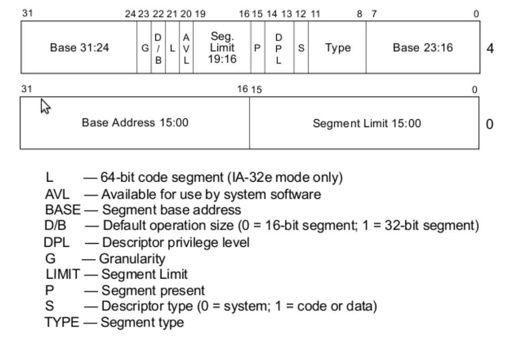

Article: https://dev.to/frosnerd/writing-my-own-boot-loader-3mld

Github Turoial: https://github.com/cfenollosa/os-tutorial

Birmingham PDF:  https://www.cs.bham.ac.uk/~exr/lectures/opsys/10_11/lectures/os-dev.pdf

OsDev Wiki: https://wiki.osdev.org/Main_Page

Book: https://littleosbook.github.io/

James Molly Tutorial: https://web.archive.org/web/20160412174753/http://www.jamesmolloy.co.uk/tutorial_html/index.html

How Computers Works: https://homepage.cs.uri.edu/faculty/wolfe/book/Readings/Reading04.htm

## Assembly

### Printing to BIOS output

- `mov ah, 0x0e` tty mode
- `mov al, 'H'` character to print into al
- `int 0x10` trigger interupt

With int 0x10 you can do other cool stuff, see [here](https://en.wikipedia.org/wiki/INT_10H)

### Interrupts
An interrupt can be called via `int 0x10`.
- `0x10` video interrupt [see](#printing-to-bios-output)
- `0x13` hard disk and floppy disk [see](#interrupt-0x13)

#### Interrupt 0x13
https://en.wikipedia.org/wiki/INT_13H

Parameters: 
| Register | Description            |
|----------|------------------------|
| AH       | 02h                    |
| AL       | Sectors To Read Count  |
| CH       | Cylinder               |
| CL       | Sector                 |
| DH       | Head                   |
| DL       | Drive                  |
| ES:BX    | Buffer Address Pointer |


Results:
| Register | Description                     |
|----------|---------------------------------|
| CF       | Set On Error, Clear If No Error |
| AH       | Return Code                     |
| AL       | Actual Sectors Read Count       |

If you are wondering what Cylinder, Sector and Head are: https://en.wikipedia.org/wiki/Cylinder-head-sector (yes, they descript a CD)

https://stanislavs.org/helppc/int_13-2.html (wtf is stanislav.org?????????)

Disk Error Doc: https://stanislavs.org/helppc/int_13-1.html

*Read disk sectors*


### Registers:
`ax`: 16 bit register
`al`: lower 8 bits
`ah`: hight 8 bits

GP registers:
ax
bx

### Loops
```
mov ax, 0

loop:
    inc ax
    cmp ax, 4
    je endloop
    jmp loop

endloop:


```

### Stack
We can push and pop 'memory' memory from the stack:\
`push 'A'`\
`pop bx` 

(Stack grows downwards, towards the bottom)\
`sp`: bottom of the stack

Auxiliary register: temporary storage registers (not special)

### Functions
We could just use jmp but how do we know where to return to? We could store the return value in some register, and jump to there. But it is easier to use the `call` and `ret` instructions.

The second problem is, that if we change registers in a function, it has side effects. To solve this, we can use `pusha` and `popa` which puts all the registers on to the stack.

### Strings
String constants are just memory at a certain address. To define a string we can use: `db 'Hello, World', 0`\
And so that we later know the address of the first char of the string we can define this below a label:

```
mystring:
    db 'Hello, World', 0
```

We need to be carefull, strings and raw data in general should be defined at a location where we don't accedentaly start executing the code. For example putting it after an infinite loop: `jmp $`

### Including files
`%include "file.asm"`

Pastes the code from the other assembly file into this file, at this location.


### Segmentation (real mode)
Segmentation means that you can specify an offset to all the data you refer to.

To compute an address the following formula is used: `segment << 4 + address`

Global Memory Offset:
`[org 0x7c00]` global offset to all memory locations, usefull to offset every memory addres to inside the boot sector, which is stored at `0x7c00`

### Segmentation / GDT (32-bit protected mode)
In 32-bit land, segmentation is handled differently.
The segment register (?) is an index in the GDT (Global Descriptor Table) to a specific SD (secment descriptor).

A segment descriptor consists of 8 bytes:
- 32 bits: start of the segment in memory
- 20 bits: length of the segment
- rest: random flags (flamour)

Ok, makes sense, but the catch is, that these bytes are not layed out completly random, see this diagram:



The first descriptor in the GDT has to be completly null (8 zero bytes).

The simplest GDT configuration consists of only two segments (actually 3 because of the null descriptor), one for code and one for data. These segments can overlap and span the entire 4GB of addressable memory.

There is also the GDT descriptor, that describes the GDT to the CPU. It consists of 6 Bytes:
- GDT size (16 bits)
- GDT address (32 bits)

### Instructions

`int` execute interupt\
`int 0x10` 

`mov` move something into a register\
`mov al, "2"` moves the ascii character 2 into al

`jmp` jump to a specific memory location

`je`: jump if equal

`push` push something onto the stack\
`push 'A'`

`pop` pop something off the stack into a register\
`pop` bx

`call` call a 'method', has the advantage over a jmp that one can use `ret`

`ret` return to where call was called :)

`pusha` pushed all registers to the stack
`popa` pops all registers from the stak

`db` define byte
`db "X"` write X to memory (statically at compile time) 

`dw` defines a word (two bytes / 16bits)

`times` repeats an instruction at compile time
`times 510 db 0` writes 510 `0` bytesstanislavs